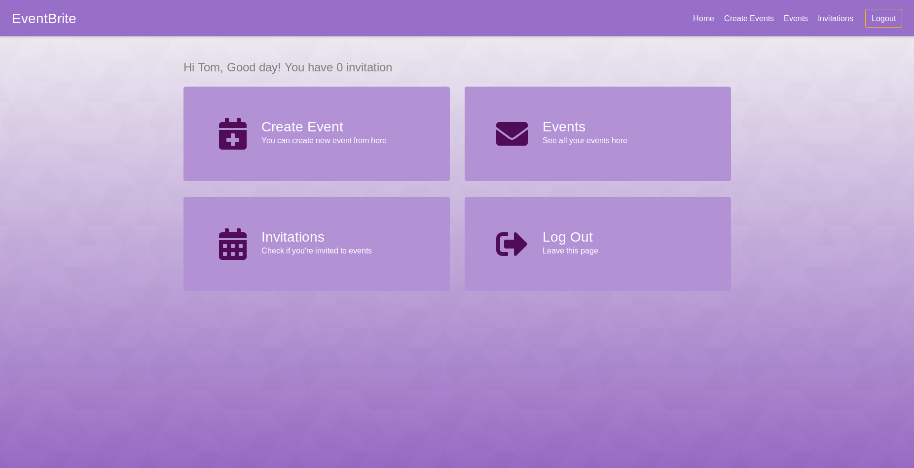

# Event Brite Clone

> Event management app. 


## Summary
<hr/>
Full stack event managment application built in Ruby on Rails framework.

Deployed version can be found at [Event brite](https://eventbriter.herokuapp.com/). Deployed version runs on [heroku](https://www.heroku.com/) platform.

## Getting started
<hr/>

Follow these instructions to get a copy of the project up and running on your local machine for development and testing purposes. 

## Prerequisites

This project runs with Ruby and RVM. If you don't have those installed, follow this [guide](https://rvm.io/rvm/install).

After installation, run `ruby -v` to make sure Ruby installed correctly.
```
$ ruby -v
> 2.6.3
```

Also make sure that RVM is installed by running `rvm -v`.

```
$ rvm -v
> 1.29.9
```

## Installations

Run &nbsp; `bundle install` to install all project gems.

## Database Setup

Run &nbsp; `rails db:migrate` to setup database and tables.

## Serve project

Start the application with the following command:

```
rails s
```
## Future Features
- Implement React as frontend
- Setup Docker image

## Authors: 
- [Zlaya](https://github.com/zlayabekrija) and [Inzi](https://github.com/inhaq)
